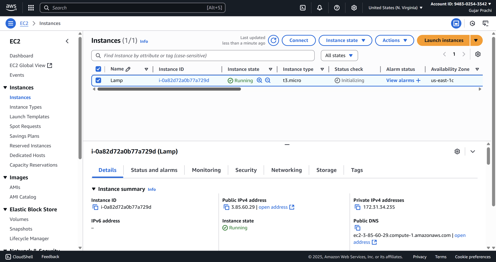
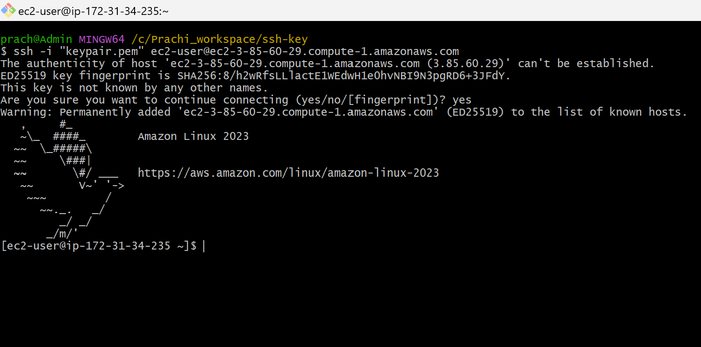
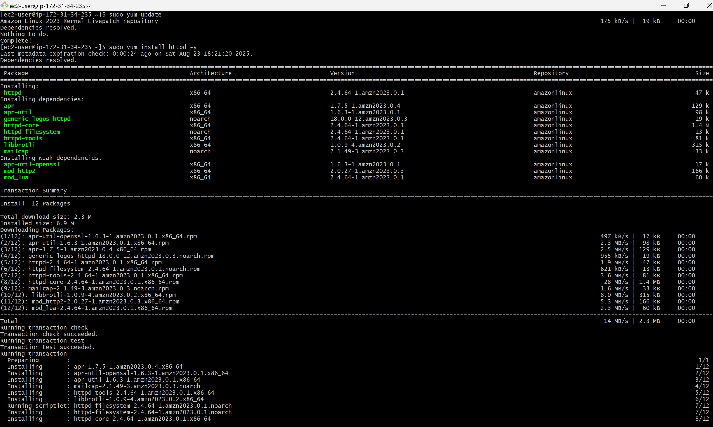
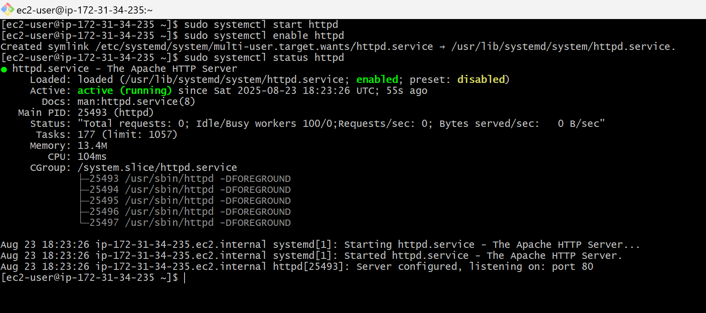
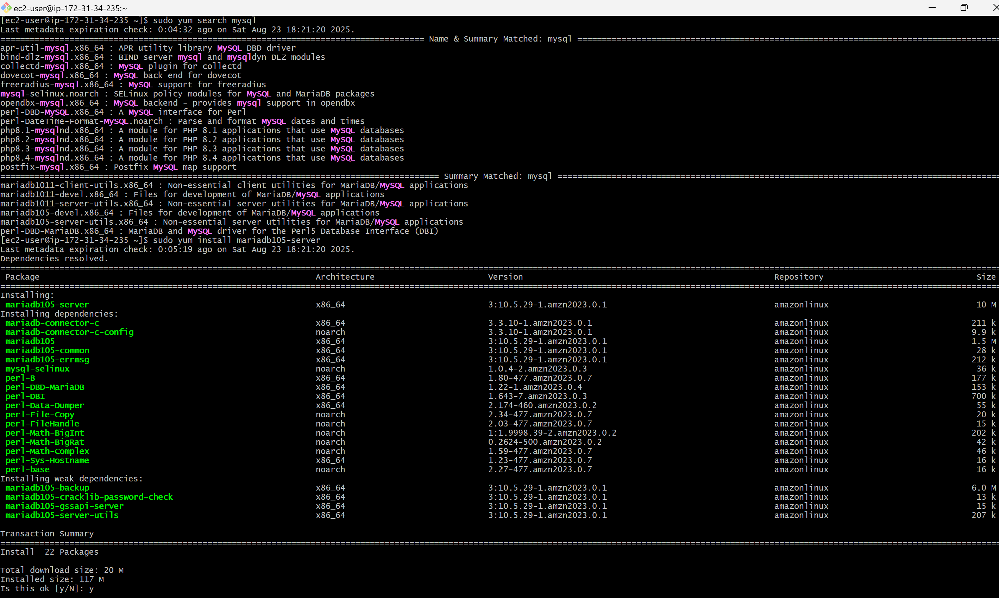
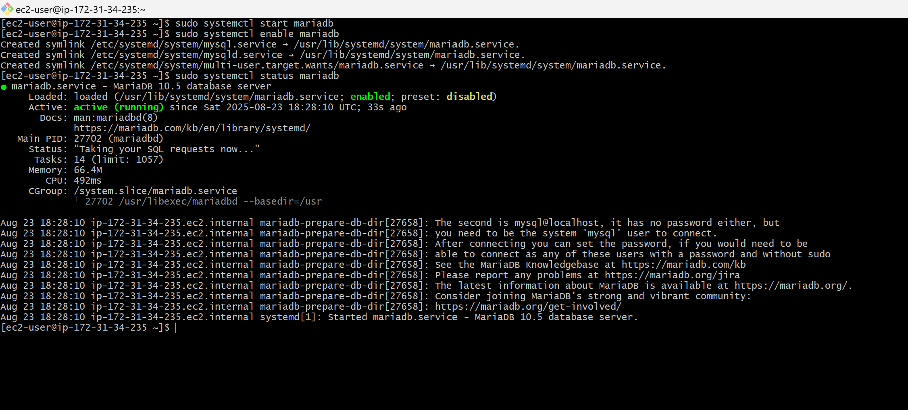
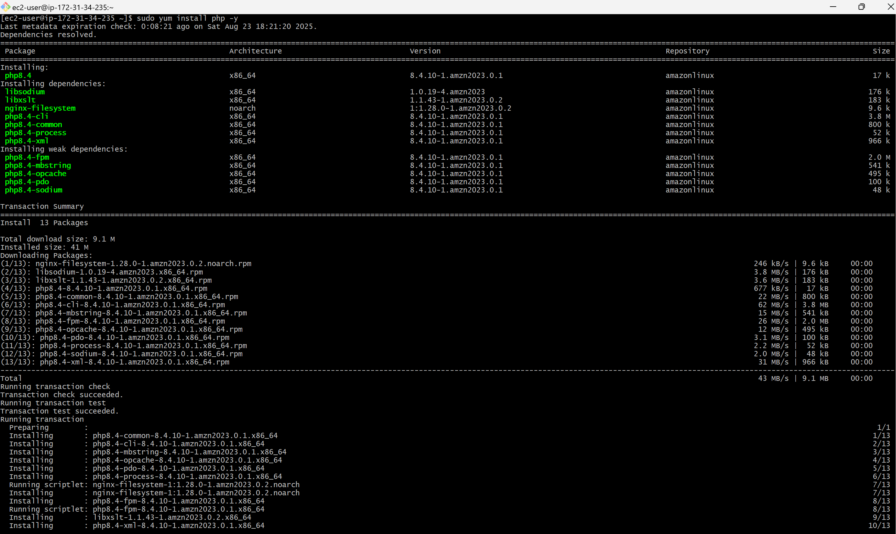
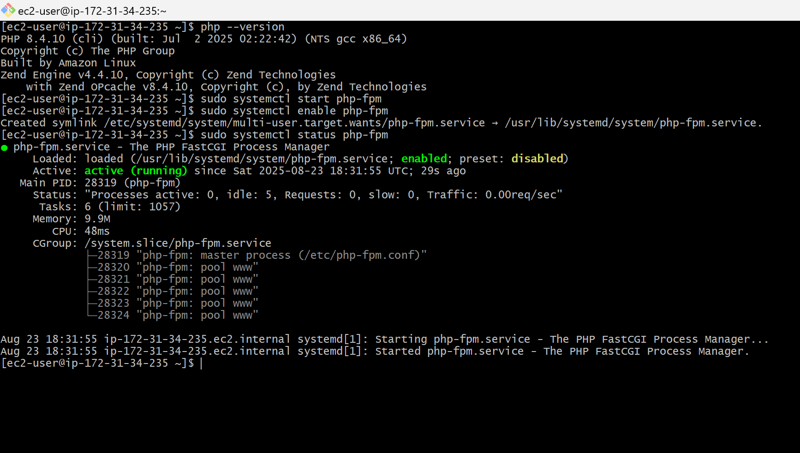
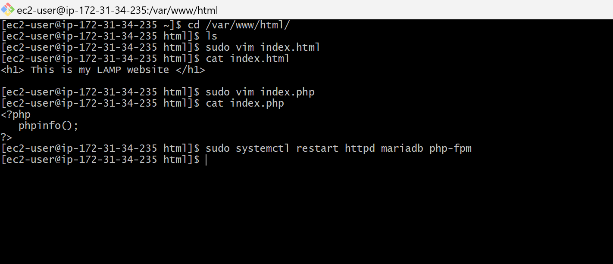
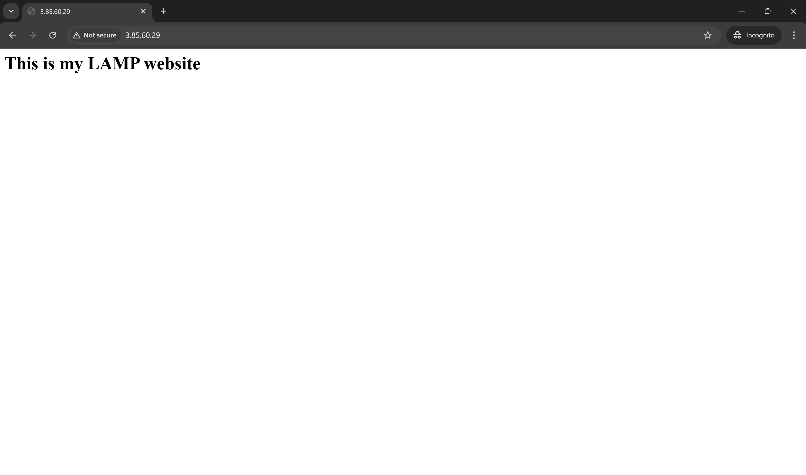

# Setting Up LAMP on Amazon Linux with Apache HTTPD
## Introduction
This project explains how to set up a LAMP stack (Linux, Apache, MySQL, PHP) on an Amazon Linux EC2 instance. It covers installing and configuring the Apache HTTPD server, setting up MySQL for database management, and enabling PHP support to serve dynamic content. This setup provides a complete environment for hosting and running web applications on AWS.

---
## Prerequisites
- AWS account (EC2 access)
- Basic Linux knowledge
- SSH key pair
- Security group: ports 80 (HTTP), 22 (SSH)
- Amazon Linux EC2 instance
- Basic knowledge of Apache, MySQL, PHP
---
## Steps to Deploy LAMP Stack

### Step 1: Login into AWS Account and Launch Ec2 Instance

### Step 2: Establishing a Secure SSH Connection to Your EC2 Instance
- Copy the SSH connection command from the SSH client and paste it into Git Bash to connect to the instance.

### Step 3: Update the system and install the Apache HTTPD server.
```bash 
# to update
sudo yum update 
```
```bash
# to install httpd
sudo yum install httpd -y
```

- Start, enable, and check the service status.
``` bash
# to start
sudo systemctl start httpd
```
``` bash
# to enable
sudo systemctl enable httpd
```
``` bash
# to check status
sudo systemctl status httpd
```

### Step 4: Install MySQL.
``` bash
# to search for the MySQL package to install
sudo yum search mysql
```
``` bash
# to install.
sudo yum install mariadb105-server -y
```

- Start, enable, and check the service status.
``` bash
sudo systemctl start mariadb
```
``` bash
sudo systemctl enable mariadb
```
``` bash
sudo systemctl status mariadb
```

### Step 5: Install PHP (FPM Included by Default with Apache HTTPD)
``` bash
# to check the PHP version
php --version
```
``` bash
# to install
sudo yum install php -y
```

- Start, enable, and check the service status.
``` bash
sudo systemctl start php-fpm
```
``` bash
sudo systemctl enable php-fpm
```
``` bash
sudo systemctl status php-fpm
```

### Step 6: Navigate to Apache HTTPD's default directory and create the files index.html and index.php.
``` bash
# to navigate to default directory
sudo /var/www/html
```
``` bash
# to create file
sudo vim file_name
```
``` bash
# to view the code
cat file_name
```
```bash
#to restart and to verify the applied changes 
sudo systemctl restart nginx
```

### Step 7: Copy the public IP address and paste it into the browser to access the website.
- The index.html file is the default page.

- To view the PHP page, enter publicip/index.php in the URL bar.

---
## Summary
This project demonstrates how to set up a LAMP stack on Amazon Linux using the Apache HTTPD server. It covers connecting to an EC2 instance via SSH, updating and installing required packages, configuring Apache, MySQL, and PHP, and creating sample files to test the setup. Finally, the hosted site is accessed using the instance’s public IP.
